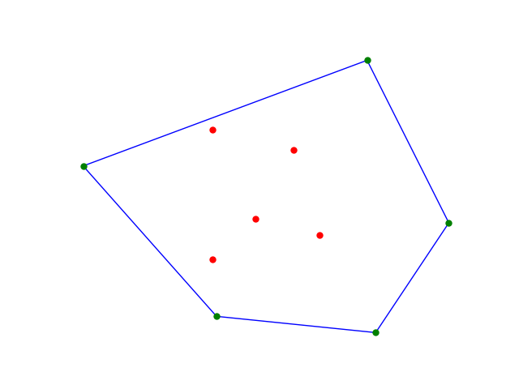
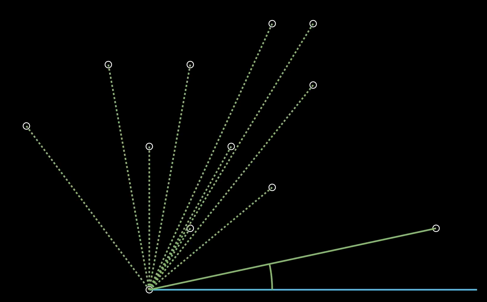
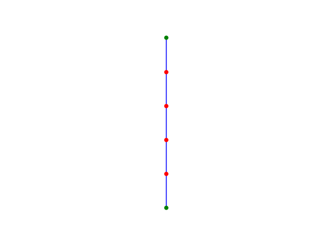

# Convex Hull

In this project, you will compute the convex hull of a given set of points. See [this very high quality video](https://youtu.be/7zp1FkRnvIA?si=8pLBG3JvKARqpxnN) for an explanation. You should watch it before you read the rest of this.

 A _convex hull_ is the smallest convex polygon that fits around a set of points. Here's an example:



In the image above, both the green and red points are in the set. The green points, however, are also the vertices of the hull. In general, the hull will always have set points for its vertices.

It might seem difficult to imagine an efficient algorithm for computing this, but it turns out there are several. We'll use Graham Scan here.

## Graham Scan

Graham Scan works by sweeping across the points in a clockwise order and trying to fit them into the hull.

The first step of the scan is to pick the point with the lowest y-coordinate. This must be in the hull since all of the vertices of the hull are points in the set. If the lowest point weren't one of them, then the polygon would never reach far enough down!

Next, we sort all of the other points by the angle they make with this lowest point:



You might remember from math that the _polar angle_ of a point is measured counter-clockwise from the positive x-axis.

As we sweep through this sorted set, we build up the hull one point at a time. Each new set is fitted into the hull. If it creates a concave angle, we remove sides of the hull until we can connect a segment that makes a convex angle with our new point.

And that's basically it! It's a pretty brilliant algorithm. Take a minute to watch the video demonstration above and convince yourself that this will work.

### Algorithm Steps

Here are the bare-bones steps of the scan:

Let \(P\) be our set of points.

1. Let \( P_0 \) be the point in \(P \) with the lowest y-coordinate
2. Sort the points in \(P \) by their polar angle from \(P_0\) in counter-clockwise order.
3. Let \( H \) be a stack representing our hull.
4. Push the first three points to the stack (\(P_0, P_1, \) and \(P_2\))
5. For each remaining point \(P_k\), pop points off the stack until the line formed between the top two points on the stack and the line formed by the top point and \(P_k\) is convex (i.e. it is a left-hand turn). Then push \(P_k\) to the stack.
6. Return the hull!

That's the whole algorithm! In the video, I used the word "backtrack," and your certainly welcome to try a recursive version of this, but it might be easier to do things iteratively.

### Going Left
The rule for convex polygons is that we always turn the same direction as we walk along the edges. Going counter-clockwise, this means we turn to the left. There is a really easy way to tell if the vertex between two lines is a left turn.

Suppose we have three points \(A, B\) and \(C\) creating two line segments \(\overline{AB}\) and \(\overline{BC}\). Then the direction of the turn is given by the cross-product of the two lines. I'm not going to get into all of the math. If you want you can read all about it [here](https://www.nagwa.com/en/explainers/175169159270/).

Instead, you've been provided with the function `ccw(p1, p2, p3))` which takes in three points and returns a negative value for a clockwise turn, positive for counter-clockwise, and 0 if the three points are all in a line.

## Edge Cases

There are a couple of edge cases to watch out for. Here are some and how to deal with them:

1. **Duplicate points**: The set _may_ contain duplicate points! Each point should be included in the hull only _once_ (no repeats).

2. **Ties for lowest y-coordinate**: If multiple points have the same lowest y-coordinate, choose the one furthest to the left.

3. **Ties for polar angle**: When you sort the points by polar angle, it is possible that some will have the same angle. Sort these in order of their distance from the bottom point.

4. **Collinear points**: If multiple points lie on the hull, we want to include only the _endpoints_. Here is an example:



Notice that only the top and bottom points are green! The other red points are not part of the hull set.


## Sorting

In Python, all lists automatically come with a `.sort()` function which takes a callback function keyword argument `key` that measures each element in some way and uses that measurement to do the sorting. You might consider something like this:

```python
sort_by_polar_angle(points, p0):
    points.sort(key=get_distance(p, p0)) # Sort by distance in case of ties
    points.sort(key=get_polar_angle(p, p0)) # Then sort by angle
```

In the example above, the sort function will measure the distance between each point `p` and the base point `p_0`. Of course, you need to define both the  `get_distance(a,b)` and `get_polar_angle(a,b)` functions yourself.

## Assignment

Complete the following functions:

- `graham_scan(points)`: Returns the minimal convex hull of the given set of points.

- `sort_points_by_polar_angle(points)`: Sorts (not returns) points by their polar angle.

Push your code to GitHub regularly (not just commit!) and I will occasionally check in and provide you feedback!

## Order you should do stuff

1. Start by getting the polar sort correct. You can test your code with a few easy points to see if it works before moving on.

2. Get Graham Scan to work without worrying about too many of the edge cases. 

3. Worry about the edge cases. There are just a few tweaks you need to make, and it's much easier to do this if you have the basic algorithm done already.

## AI/Research Policy

You should not use AI for this assignment. You also should not look up Graham Scan. At best, you'll get the answer without thinking about it very hard (which defeats the purpose) and at worst, you'll waste a bunch of time on stuff you don't need to know: you have everything you need to get this done!

## Helpful Things

- The `Stack` class in the `friendsbalt` package has a new `peek()` function that accepts an optional argument: `peek(1)` is the same as `peek()`, `peek(2)` shows you the second thing from the top, and so on.

- The `Plotter` class will output an image each time you run `graham.py` so that you can see if the program worked. The file will be saved in the root directory as `graham_scan.png`.

- There are some free test cases in the `test_cases` directory. These are just text files with lists of points. You can run `python graham.py test_cases/horizontal.txt` and the program will automatically load these points in and plug them into `get_convex_hull(points)`.

- If you don't like all that terminal business, you can open the "Run and Debug" pane in the sidebar and choose one of the tests from the dropdown.